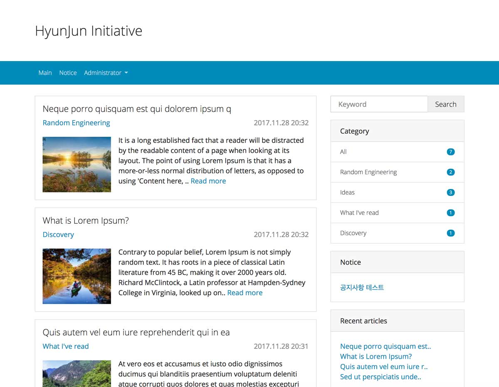
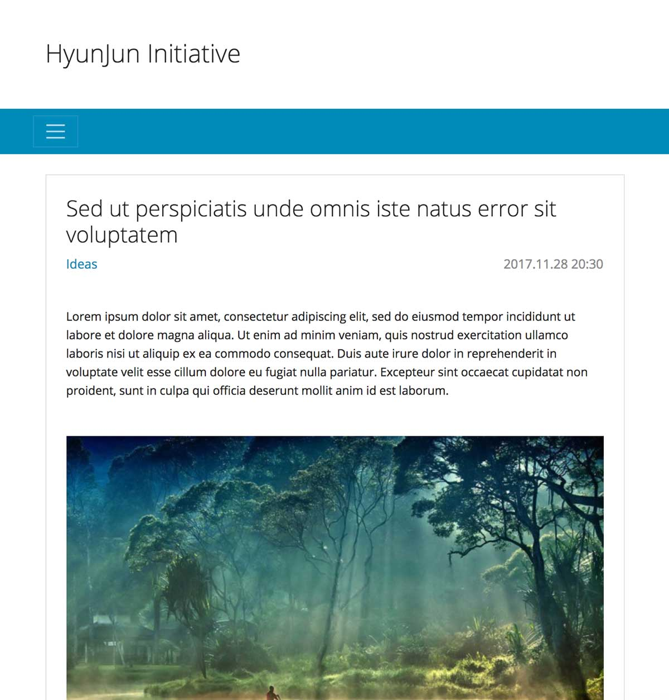

# tistory-essence-skin

> Essence: Simple and structured Tistory blog skin

## 소개
[Bootstrap 4](https://getbootstrap.com)를 기반으로 한 간결하고 미려한 반응형 티스토리 스킨입니다. 직접 운영할 블로그에 적용하기 위해 만들어졌기 때문에 글 읽기와 카테고리 기능 외로는 대부분 제거하였습니다. 댓글은 [Facebook Comment Plugin](https://developers.facebook.com/docs/plugins/comments/)을 사용합니다.

## 미리보기

데모: [개발자 블로그](http://hyunjun.org)

- 메인 페이지

- 글 읽기 페이지

## 스킨 적용하기
`src` 폴더 내에 있는 모든 파일을 티스토리 커스텀 스킨으로 등록하면 됩니다. 

## 라이센스
MIT